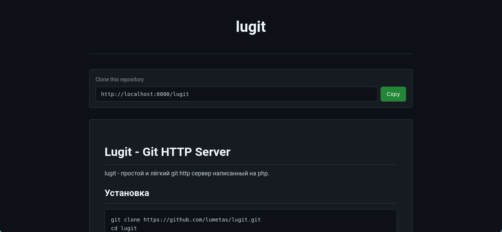

# Lugit - Git HTTP Server

lugit - простой и лёгкий git http сервер написанный на php.

## Установка
```bash
git clone https://github.com/lumetas/lugit.git
cd lugit
composer install
```

## Запуск
```bash
php -S localhost:8080 -t public
```

## Настройка 
скопируйте файл config.json.example в config.json и замените все поля на свои.

В поле repositoriesPath укажите путь к папке с bare репозиториями.

excludeFolders - список файлов и папок которые должны быть исключены из списка репозиториев.

enableRegister - включить регистрацию пользователей через консольный клиент.

Каждый пользователь может иметь поле `allow_cicd` (true/false). Если `allow_cicd: false`, пользователь может только просматривать логи CI/CD. По умолчанию (если поле отсутствует) — false. При регистрации через клиент (`lugit register`) пользователь создаётся с `allow_cicd: false`.

Зарегестрировать первого клиента:
```bash
php register.php
```
Скрипт спросит username и password и зарегистрирует пользователя в системе.

## Создание первого репозитория
Авторизуемся в системе через консольный клиент:
```bash
./bin/lugit login http://localhost:8080 alice secret123
``` 

Создаём новый репозиторий:
```bash
./bin/lugit create my-project
```

После создания репозитория вы можете получить его git адрес через консольный клиент:
```bash
./bin/lugit info my-project
```

Пользователи могут добавляться в репозитории через консольный клиент:
```bash
./bin/lugit user-add my-project bob
```

## CI/CD

lugit имеет встроенную систему CI/CD. Вы можете загрузить любой исполнительный скрипт на сервер, и он будет автоматически запускаться при пуше в указанную ветку.

### Команды

**Установка хука:**
```bash
lugit cicd-set <репозиторий> <ветка> <путь/к/скрипту>
```

Загружает скрипт на сервер. Скрипт сохраняется в `lugit/hooks/<ветка>` внутри bare репозитория и автоматически запускается при пуше в эту ветку.

Пример:
```bash
lugit cicd-set my-project main ./deploy.sh
```

**Удаление хука:**
```bash
lugit cicd-del <репозиторий> <ветка>
```

**Список хуков:**
```bash
lugit cicd-list <репозиторий>
```

**Ручной запуск:**
```bash
lugit cicd-run <репозиторий> <ветка>
```

Запускает хук вручную без пуша.

**Просмотр логов:**
```bash
lugit cicd-logs <репозиторий> <ветка>
```

Показывает логи выполнения хука для указанной ветки. Доступно всем пользователям, имеющим доступ к репозиторию (даже без `allow_cicd`).

Пример:
```bash
lugit cicd-logs my-project main
```

**Очистка логов:**
```bash
lugit cicd-logs-clean <репозиторий> <ветка>
```

Очищает файл лога для указанной ветки.

Пример:
```bash
lugit cicd-logs-clean my-project main
```

### Как это работает

1. При установке хука (`cicd-set`) скрипт сохраняется в `<repo>/lugit/hooks/<branch>` и делается исполнимым.
2. В bare репозиторий устанавливается `hooks/post-receive`, который автоматически запускает нужный скрипт при пуше.
3. При пуше git receive-pack запускает post-receive hook, тот определяет ветку, находит соответствующий скрипт в `lugit/hooks/`, и запускает его асинхронно (через nohup).
4. Вывод скрипта сохраняется в `<repo>/lugit/logs/<branch>`.
5. При ручном запуске (`cicd-run`) скрипт запускается так же асинхронно.

### Права доступа

- `allow_cicd: true` — пользователь может управлять хуками (set, del, run, list) и просматривать логи.
- `allow_cicd: false` — пользователь может только просматривать логи (`cicd-logs`).
- При включённой регистрации новые пользователи получают `allow_cicd: false`.

## WEB интерфейс
Скорее можно сказать что отсутствует, есть одна страница /repos/{repoName} на которой отображается ссылка для клонирования репозитория и его README.md если он есть и репозиторий является публичным.

## Права доступа
Репозитории могут быть публичными или приватными, по умолчанию репозитории считаются приватными. Чтобы это изменить можно сделать так:
```bash
./bin/lugit set-public my-project
```
После этого даже не авторизованные пользователи смогут склонировать репозиторий через git. А вы можете отправить им ссылку.

И наоборот:
```bash
./bin/lugit set-private my-project
```


Скриншот веб интерфейса:

